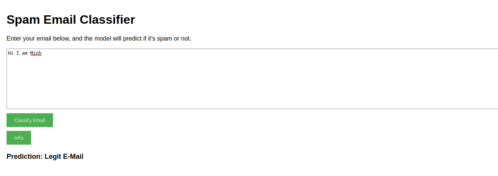

# Spam Email Classifier  

A simple Machine Learning project to classify spam email and normal email. This project is to understand basic concepts of LLM and deploy a model on a server using fastapi and interact with HTML UI

## Dataset

This project utilizes the [Spam Emails Dataset](https://www.kaggle.com/datasets/ashfakyeafi/spam-email-classification/data), a dataset in machine learning that contains many samples of Emails and messages, each classifier into two classes: ham(for legit email) and spam (for spam email)

## Installation & Setup

### Prerequisites
- Python 3.8+  
- FastAPI  
- Scikit-learn  
- Pandas
- HTML 

## Export classification model 
- To re-train or export new models run command: 
    ```bash
    python export_model.py 
    ```

### Running Steps using Docker (Port 8888)
1. **Clone the repository**  
   Clone the project repository to your local machine.
   ```bash
   git clone <repository-url>
   cd <repository-folder>
   ```

2. **Install dependencies**  
   Install the required Python dependencies.
   ```bash
   pip install -r requirements.txt
   ```

3. **Build Docker Image**
   ```bash
   docker build -t app .
   ```

4. **Run Docker Image**
   ```bash 
   docker run -p 8888:8888 app
   ```
  
### Running Steps Locally (If run locally, default port will be 8000)
1. **Clone the repository**  
   Clone the project repository to your local machine.
   ```bash
   git clone <repository-url>
   cd <repository-folder>
   ```

2. **Install dependencies**  
   Install the required Python dependencies.
   ```bash
   pip install -r requirements.txt
   ```

3. **Start the FastAPI server**  
   Run the FastAPI server to serve the model (default port 8000).
   ```bash
   127.0.0.1:8000
   ```
   ```bash
   uvicorn server:app --reload
   ```
   or 
   ```bash
   python -m uvicorn server:app --reload 
   ```

4. **Access API Documentation**  
   Open the following API documentation in your browser:
   - Local Server: 
      - Swagger UI: [http://127.0.0.1:8000/docs](http://127.0.0.1:8000/docs)
      - Redoc: [http://127.0.0.1:8000/redoc](http://127.0.0.1:8000/redoc)
   - Remote Sever using Railway: [https://spam-email-classifier-production.up.railway.app/docs](https://spam-email-classifier-production.up.railway.app/docs)

5. **Run the client-side application**  
   Open web/index.html in web browser

## API Endpoints

### **POST** `/predict`

Predicts the E-Mail if it is a Spam E-Mail or not

- **Request Body (JSON):**
  ```json
  {
    "text": "Hi I am Minh"
  }
  ```
- **Response:**
  ```json
  {
    "prediction": "ham"
  }
  ```

### **GET** `/`

Give the information of project to user

- **Response:**
  ```json
  {
    "info": "Welcome to Dang Minh EMail Spam Classifier Model, this is a personal project to practice my knowledge in NLP and MLops"
  }
  ```

### Deploy remotely on Railway 
Server URL 
    ```bash
    https://spam-email-classifier-production.up.railway.app/ 
    ```

## Expandability

This project can be expanded beyond just the provided HTML file. It can be integrated with other web frameworks, such as ReactJS, to create an even more interactive and user-friendly interface. This will further enhance the usability and scalability of the application.

## Demo Usage



## Contributing

Contributions are welcome! If you find any issues or want to suggest improvements, feel free to open an issue or submit a pull request.

## License
[](https://opensource.org/licenses/MIT)
This project is licensed under the MIT License.
